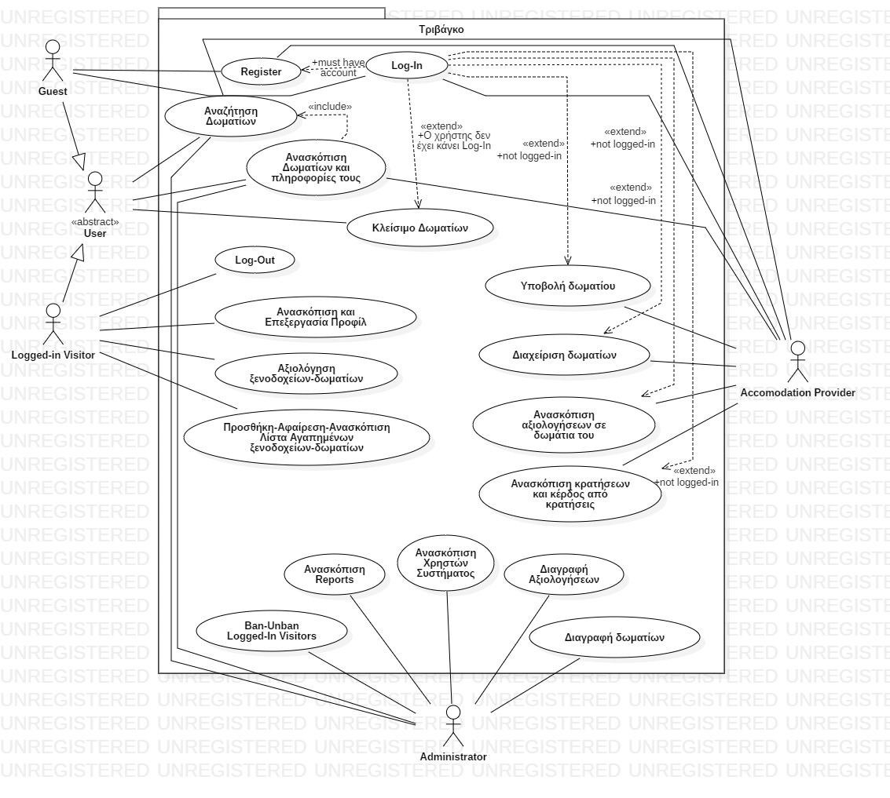

# Σκοπός του Συστήματος
Να παρέχει την δυνατότητα σε πάροχους διαμονής (πχ ξενοδόχους) να υποβάλουν δωμάτια ξενοδοχείων ή γενικότερα ενοικιαζόμενα δωμάτια στο σύστημα, τα οποία μπορούν να αναζητήσουν επισκέπτες καθώς και να τα κλείσουν μέσω του συστήματος.

# Μοντέλο Χρέωσης
Το σύστημα αυτό θα επιφέρει κέρδη κρατώντας ένα ποσοστό (πχ 5-10%) των χρημάτων που ξοδεύονται από επσικέπτες κατά το κλείσιμο δωματίου από κάποιον πάροχο διαμονής.

# Κατηγορίες Χρηστών
Οι κατηγορίες των χρηστών αυτού του Συστήματος είναι οι εξής:

1. Διαχειριστής (Administrator)
2. Πάροχος Διαμονής (Accomodation Provider)
3. Συνδεδεμένος Επισκέπτης (Logged-in Visitor)
4. Μη Συνδεδεμένος Επισκέπτης (Guest)

# Εμβέλεια του Συστήματος
Το σύστημα αυτό δεν θα φτάσει σε σημείο να εκπληρώνει πραγματικές χρηματικές συναλλαγές με κάρτες αλλά θα τις προσομοιώνει για τους λόγους του project.

# Παραδοχές
* Οι ρόλοι χρηστών είναι mutually exclusive (δεν μπορεί κάποιος να έχει πάνω από έναν ρόλο). Έτσι, όταν ένας χρήστης γίνεται promoted σε admin τότε χάνει τον προηγούμενο του ρόλο μαζί με τις πληροφορίες αυτού.
* Πληρωμές μόνο με πιστωτική κάρτα (σαν simulation - θεωρώντας ότι πάντα το υπόλοιπο θα επαρκεί - δεν θα υπάρξει επικοινωνία με τράπεζες)

# Απαιτήσεις
Οι **Λειτουργικές Απαιτήσεις** του συστήματος αποτελούν την υποστήριξη όλων των ενεργειών κάθε χρήστη του. Περιλιπτικά αυτές δύναται να είναι:

#### 1. Διαχειριστής (Administrator)
* Ban / Unban χρήστες (τύπου 2. και 3.)
* Promote χρήστη σε admin (ο χρήστης χάνει τον παλιό του ρόλο)
* Ανασκόπιση reports από χρήστες (τύπου 2. και 3.)
* Δυνατότητα διαγραφής αξιολογήσεων επισκεπτών
* Δυνατότητα διαγραφής δωματίων από πάροχο διαμονής
* Αναζήτηση δωματίων (ως Guest)

#### 2. Πάροχος Διαμονής (Accomodation Provider)
* Εγγραφή & Σύνδεση
* Υποβολή δωματίου (με μοναδικό στίγμα τοποθεσίας, 0 ή παραπάνω εικόνες, περιγραφικά δεδομένα με ελεγχόμενο πεδίο τιμών, description, παροχές με ελεγχόμενο πεδίο τιμών)
* Επισκόπηση υποβεβλημένων δωματίων και αξιολογήσεών τους (χωρίς δυνατότητα διαγραφης αλλά δυνατότητα report) από τους χρήστες
* Προσθήκη, διαγραφή, τροποποίηση υποβεβλημένων δωματίων
* Λήψη ειδοποιήσεων όταν γίνεται συναλλαγή για δωμάτιο που έχει υποβάλει
* Ανασκόπιση στατιστικών (αριθμός κρατήσεων σε κάθε δωμάτιο, κέρδος αυτού, κέρδος από σύστημα)
* Αναζήτηση ξενοδοχείων/δωματίων όπως οι άλλοι χρήστες

#### 3. Συνδεδεμένος Επισκέπτης (Logged-in Visitor)
* Εγγραφή & Σύνδεση
* Αναζήτηση δωματίων (βάσει τοποθεσίας, εύρος τιμής, απόστασης από τοποθεσία, παροχές με ελεγχόμενο πεδίο, βαθμολογία/κριτικές, όνομα δωματίου)
* Κλείσιμο δωματίων με online πληρωμή (μέσω κάρτας)
* Προφιλ (με στοιχεία πληρωμής, λίστα αγαπημένων, αξιολογήσης του)
* Δυνατότητα αξιολογήσεων (κλίμακα αστεριών, σχόλια) και επισκόπισή τους
* Προσθήκη δωματίων σε λίστα "αγαπημένα" και επισκόπισή της

#### 4. Μη Συνδεδεμένος Επισκέπτης (Guest)
* Εγγραφή & Σύνδεση
* Αναζήτηση δωματίων (βάσει τοποθεσίας, εύρος τιμής, απόστασης από τοποθεσία, παροχές με ελεγχόμενο πεδίο, βαθμολογία/κριτικές, όνομα δωματίου)
* Κλεισιμο δωματίων αλλα prompt για log-in κατά την ολοκλήρωση (πληρωμή)

Οι ίδιες απαιτήσεις φαίνονται από το παρακάτω UML use-case diagram:

Οι **Μη Λειτουργικές Απαιτήσεις** του συστήματος δύναται να είναι οι εξής:
* Το authentication των συνδεδεμένων χρηστών πρέπει να είναι ασφαλές
* Το κλείσιμο ενός δωματίου πρέπει να είναι ατομική πράξη (αν αφαιρεθούν λεφτά το δωμάτιο πρέπει να έχει κλεισθεί επιτυχώς)
* Η αναζήτηση δωματίων πρέπει να είναι γρήγορη ώστε να προσφέρεται καλό U.X.
* Τα UIs πρέπει να είναι εύχρηστα
* Να είναι έμπιστοι οι πάροχοι
* Να είναι κόσμιες οι αξιολογήσεις
* Γρήγορη πλοήγηση
