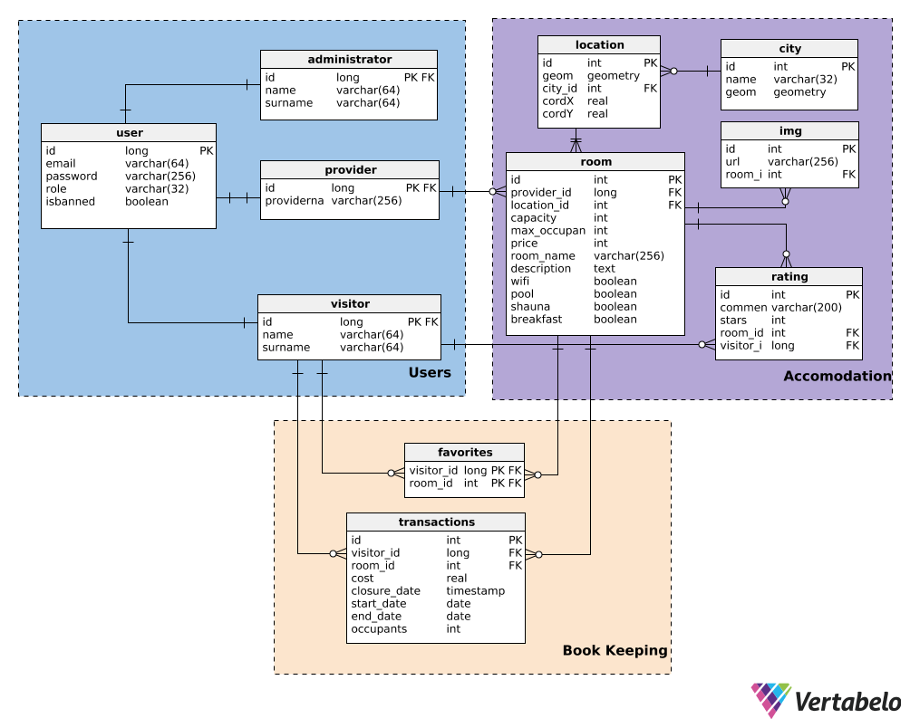
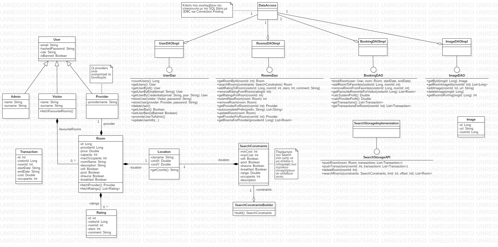

# Τεχνικές Προδιαγραφές

Στην ιστοσελίδα αυτή θα χρησιμοποιηθεί το REACT framework για το frontend η οποία ακολουθεί το μοντέλο MVVM και επιτρέπει την ανάπτυξη των UIs σε δηλωτικό επίπεδο. Στο backend θα γίνει μια Restful υλοποιηση που ακολουθεί το MVC πρότυπο (control -> resources, model -> java classes, view -> JSon), ενώ η επικοινωνία με την κύρια βάση θα γίνει με το JDBC Spring template.

Σε συνεργασία με την εφαρμογή μας θα χρησιμοποιηθεί το API του OSM (open street map) έτσι ώστε να έχουμε έγκυρα δεδομένα και πρακτικό user interface.

Σαν κύρια (consistant) βάση δεδομένων επιλέχθηκε η PostgreSQL, η οποία υποστηρίζει SQL transactions και γενικά το A.C.I.D., έτσι ώστε να έχουμε βέλτιστη απόδοση στα γεωχωρικά δεδομένα με την χρήση του GIS module της (κάτι που απουσιάζει λ.χ. από την MySQL). 

Προκειμένου να έχουμε καλύτερη απόδοση και να υποστηρίζουμε full text αναζητήσεις θα χρησιμοποιήσουμε, παράλληλα με την PostgreSQL, το elastic data store ως δευτερεύουσα (όχι πάντα consistent) βάση δεδομένων. Εκεί θα αποθηκεύουμε όλες τις σχετικές searchable πληροφορίες για rooms σε ένα index. Κάθε σχετικό insert / update / delete στην πρώτη πρέπει να μεταφέρεται στην δεύτερη, ώστε οι πληροφορίες της να είναι ανανεωμένες όσο το δύνατόν.

Το Schematic της κύριας SQL βάσης δεδομένων μας είναι το εξής:

Το UML class diagram για το backend είναι το εξής:

